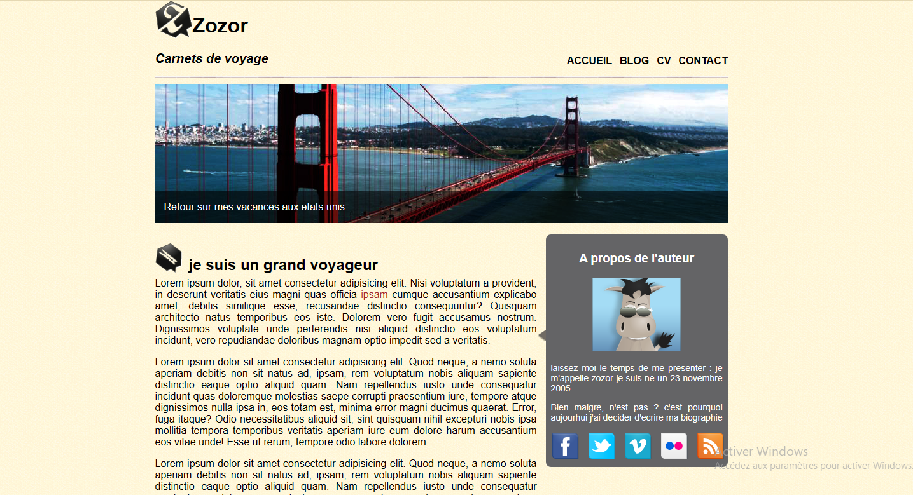
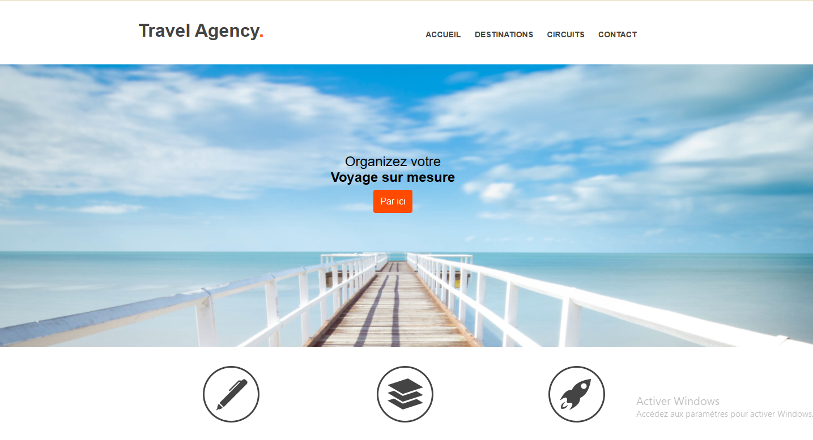
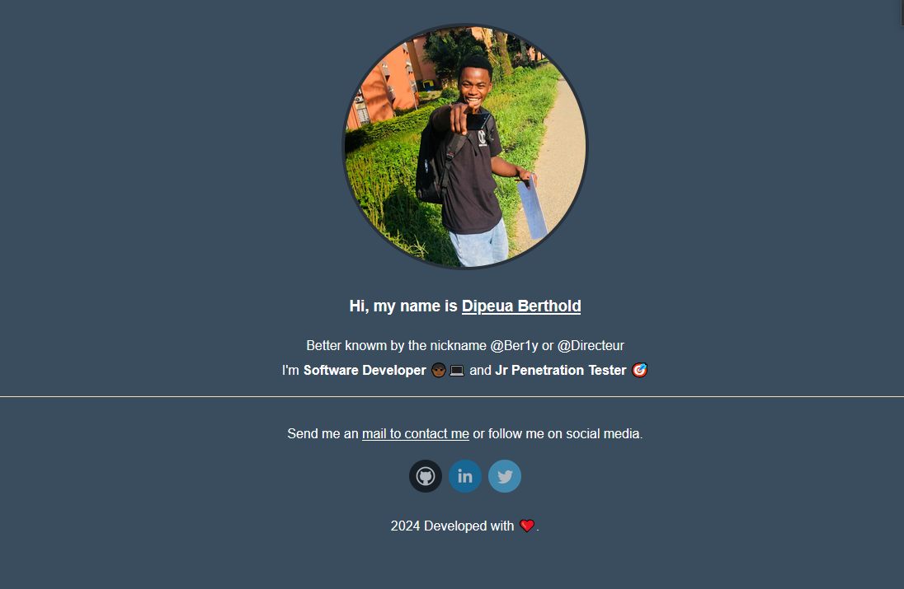

Mes première ligne de code HTML5 et CSS3

# Mon premier (CV)

Voici ma premier application web en 2017 c'est fou je l'avais encore  😂

[Check](./Old%20CV/index.html)

En ce moment je fessais la classe de 2nd sa fait du bien de pouvoir la mettre sur GitHub aujourd'hui. Beaucoup de chose ont changer depuis 🤓

# Zozor

Et puis après 06 mois en jonglent entre l'école et ma formation autodictée en développement web je suis en fin parvenu a réalise le fameux **_Zozor_**.
Bref le code n'était pro je l'accord mes le résultat était celui attendu. 😉

[Zozor](./Zozor/index.html)

Cela pour dire garder la même passion ! ❤️ Computer

# Travel Agency

Une autre réalisation fue **_Travel Agency_**  de **Formation Video**

[Travel Agency](./Travel%20Agency/index.html)

# Dipeua

Mon mimi portfolio 

[Dipeua](./Dipeua/index.html)